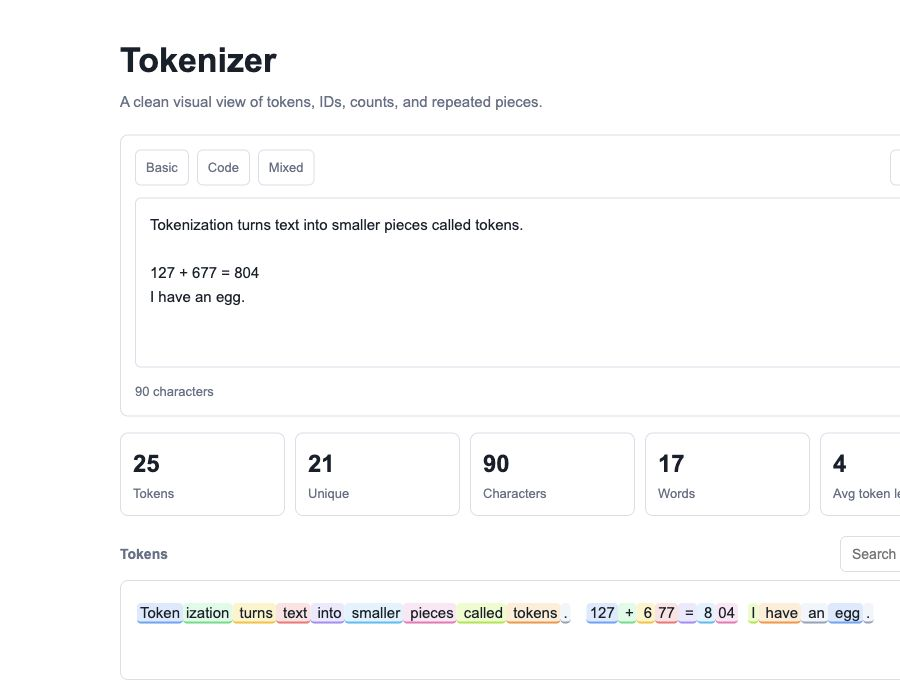

# Tokenizer App

A clean Flask web app for visualizing how text is split into tokens. Paste text, inspect token IDs, search tokens, view frequency, and copy the results for analysis.



## Features

- Real tokenization using `tiktoken`
- Simple white interface with responsive layout
- Live token count, unique tokens, characters, words, average token length, and repeated token count
- Colored token visualization with hover details
- Search tokens by text or token ID
- Frequency chart for the most common tokens
- Token table with index, token text, token ID, and character length
- Copy token IDs or export the token table as CSV text

## Tech Stack

- Python
- Flask
- tiktoken
- HTML
- CSS
- JavaScript

## Project Structure

```text
tokenizer-app/
├── app.py
├── requirements.txt
├── README.md
├── docs/
│   └── screenshot.png
└── static/
    └── index.html
```

## Getting Started

### 1. Clone the repository

```bash
git clone https://github.com/YOUR-USERNAME/tokenizer-app.git
cd tokenizer-app
```

### 2. Create a virtual environment

```bash
python3 -m venv .venv
source .venv/bin/activate
```

### 3. Install dependencies

```bash
pip install -r requirements.txt
```

### 4. Run the app

```bash
python app.py
```

Open the app in your browser:

```text
http://127.0.0.1:5000/
```

## API

The app exposes one endpoint:

```http
POST /tokenize
```

Example request:

```json
{
  "text": "Tokenization turns text into tokens."
}
```

Example response:

```json
{
  "tokens": ["Token", "ization"],
  "ids": [30642, 1634],
  "stats": {
    "total": 2,
    "unique": 2,
    "chars": 12,
    "words": 1,
    "lines": 1,
    "avg_len": 6,
    "top": [["Token", 1]],
    "repeated": 0,
    "longest": "ization"
  }
}
```

## Development Notes

- The backend lives in `app.py`.
- The frontend is a single static file at `static/index.html`.
- `.venv`, `__pycache__`, `.DS_Store`, and zip files are ignored by Git.

## Future Improvements

- Add token cost estimation
- Add side-by-side text comparison
- Export tokens as JSON or CSV files
- Add light/dark theme toggle
